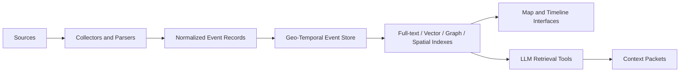

<p align="center">
  
</p>
# Eva

[](https://github.com/wmw987/eva/actions/workflows/tests.yml)
[](LICENSE)


Local-first geo-temporal context layer for LLM agents.

Eva is an early public specification and prototype skeleton for a local-first geo-temporal context layer for LLM agents.

It is not a finished product yet.

The current repository focuses on:

- documenting the architecture
- showing a minimal local prototype
- using synthetic demo events
- testing the basic ingest and query flow
- keeping the design local-first and privacy-aware

Eva models events by time, place, source, confidence, risk, and relationships, then exposes bounded context packets for agent reasoning.

Technical architecture: **Geo-Temporal Context Core**.

## Why

Vector memory is useful, but it often loses the operational shape of real-world context:

- when something happened
- where it happened
- which source supports it
- how confident the system is
- what changed over time

Eva treats the LLM as an interpreter over structured context, not as the database of record.

## Status

Eva is currently an early public specification and prototype skeleton.

## What works today

- Create an empty SQLite event table.
- Validate synthetic event fixtures against JSON Schema.
- Validate synthetic context packets.
- Ingest a synthetic event into SQLite.
- Query synthetic events back as bounded context packets.
- Run tests without any real operational data.

## What is not implemented yet

- No production collector.
- No real data ingestion in the public repository.
- No map or timeline UI.
- No MCP server.
- No temporal supersession engine.
- No production-ready geospatial index.

## Quick start

Create a virtual environment and install development dependencies:

```bash
python3 -m venv .venv
source .venv/bin/activate
python -m pip install -r requirements-dev.txt
```

On Windows PowerShell:

```powershell
python -m venv .venv
.venv\Scripts\Activate.ps1
python -m pip install -r requirements-dev.txt
```

Run the tests:

```bash
python -m unittest discover -s tests
```

Create an empty SQLite store and ingest the synthetic event:

```bash
python scripts/ingest_synthetic.py --db eva.db examples/synthetic_event.json
```

Query it back as a context packet:

```bash
python scripts/query_events.py --db eva.db --region "Example Region" --since PT48H --risk high
```

## Example output

A basic query may return a context packet similar to this:

```json
{
  "query": {
    "region": "Example Region",
    "since": "PT48H",
    "risk": "high"
  },
  "events": [
    {
      "id": "synthetic-event-001",
      "title": "Synthetic infrastructure event",
      "source_type": "synthetic",
      "confidence": "demo"
    }
  ]
}
```

This is synthetic demo data only.

## Architecture



## Repository layout

```text
docs/       Architecture, privacy model, origin, publishing notes
schemas/    JSON Schemas for public interfaces
examples/   Synthetic fixtures only
db/         Empty database migrations
scripts/    Minimal synthetic ingest and query scripts
tests/      Tests that use only synthetic fixtures
```

## Security and privacy

This repository is designed to be useful from zero without publishing operational data.

It should not contain:

- public data dumps
- scraped corpora
- real event records
- generated reports
- populated databases
- map exports
- logs
- telemetry
- local paths
- hostnames
- credentials
- tokens

Use synthetic fixtures for public examples.

Connect real sources only in your own private local deployment.

## Origin

Eva originated from local-first agent-memory experiments in OpenClaw, but the public core is runtime-agnostic.

## Documentation

- [Roadmap](ROADMAP.md)
- [Geo-Temporal Context Core](docs/GEO_TEMPORAL_CONTEXT_CORE.md)
- [Start From Zero](docs/START_FROM_ZERO.md)
- [Privacy Model](docs/PRIVACY_MODEL.md)
- [OpenClaw Origin](docs/OPENCLAW_ORIGIN.md)
- [Maintainer Guide](docs/MAINTAINER_GUIDE.md)

## License

MIT.
